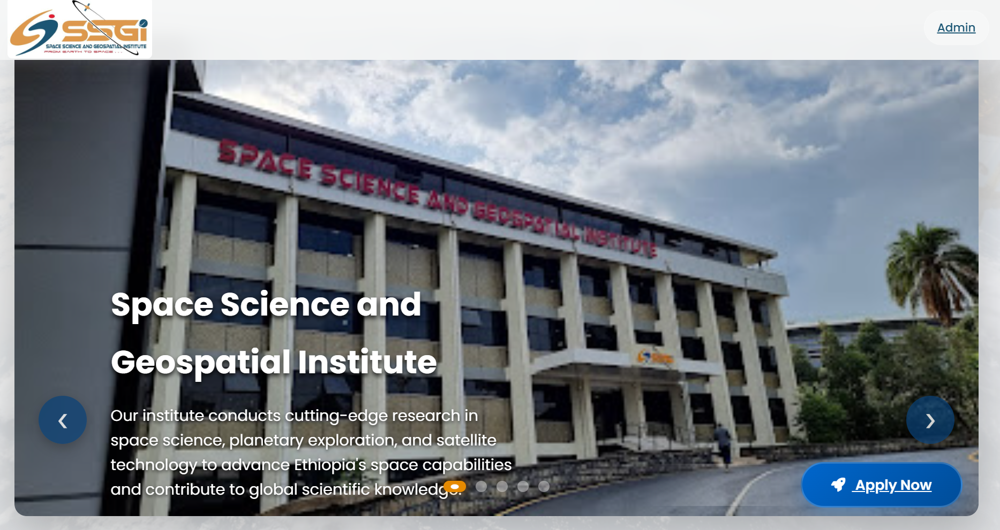
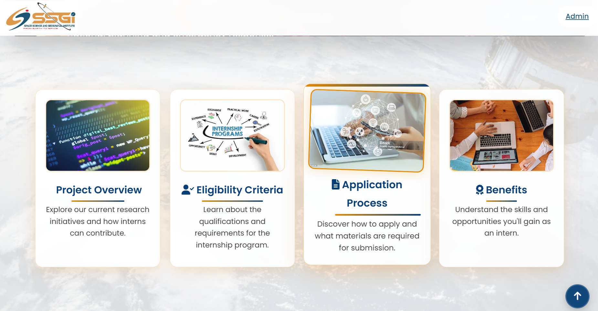
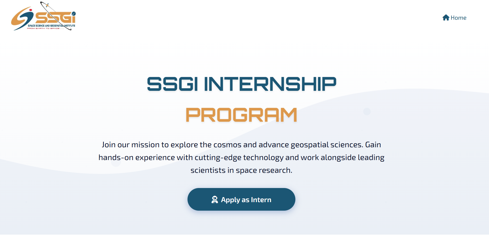
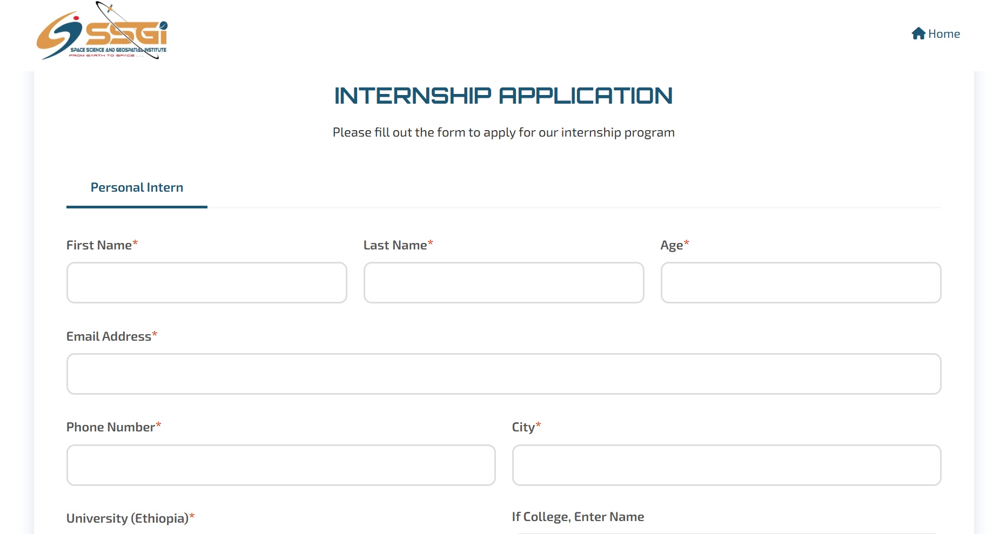
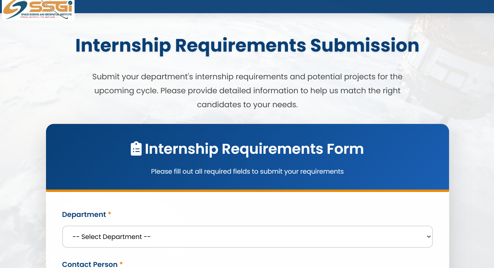
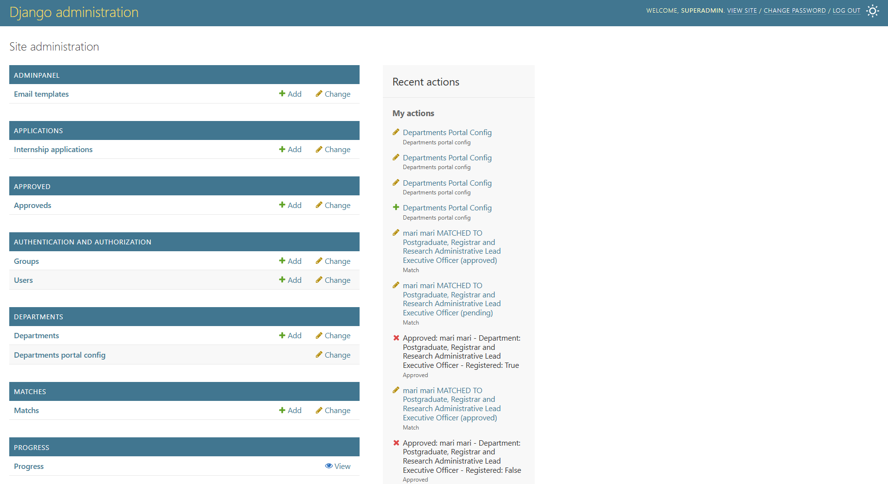

# Internship Management System

An Internship Management System built with **Django** and **PostgreSQL** to streamline the process of handling internship applications, department requirements, approvals, and student placements.

This project helps organizations manage internships by allowing students to apply online, departments to submit requirements, and admins to approve and monitor the overall process.

---

## Features

- 📝 **Student Applications** – Students can apply for internship opportunities via an online form.
- 🏢 **Department Management** – Departments submit requirements, specify preferred fields and number of interns, and view assigned interns.
- ✅ **Approval Workflow** – Admins review, approve, or reject applications and department requirements.
- 🔗 **Matching Algorithm** – Matches interns to departments based on skills, interests, and department needs.
- 📊 **Dashboard** – Track approved interns, assigned departments, pending matches, and statistics.
- 💾 **Database Integration** – All data is stored securely in PostgreSQL, including applications, department requirements, matches, and approvals.
- 📂 **Export Support** – Generate reports (Excel/CSV) for approved internships and department assignments.
- 🔒 **Admin Panel** – Manage students, departments, matches, and approvals with custom actions and filters.

---

## Tech Stack

- **Backend:** Django (Python)
- **Frontend:** HTML, CSS, JavaScript (Vanilla + Bootstrap)
- **Database:** PostgreSQL
- **Other Tools:** Django Admin Panel, openpyxl (for Excel export)

---

## Installation

### 1. Clone the repository

```sh
git clone https://github.com/your-username/internship-management-system.git
cd internship-management-system
```

### 2. Set up the Python environment

```sh
python -m venv venv
venv\Scripts\activate      # Windows
# or
source venv/bin/activate   # Mac/Linux
```

### 3. Install dependencies

```sh
pip install -r requirements.txt
```

### 4. Configure PostgreSQL

- Create a PostgreSQL database named `intern`.
- Update `DATABASES` in `stellar_core/settings.py` with your PostgreSQL credentials (or use `.env` for secrets).

### 5. Run migrations

```sh
python manage.py makemigrations
python manage.py migrate
```

### 6. Create a superuser

```sh
python manage.py createsuperuser
```

### 7. Start the development server

```sh
python manage.py runserver
```

---

## Usage

- **Admin Panel:** Manage students, departments, matches, and approvals at  
  👉 http://127.0.0.1:8000/admin/
- **Students:** Apply for internships through the application form at `/apply/`.
- **Departments:** Submit requirements via the department portal at `/departments/`.
- **Approvals:** View and approve submitted applications and requirements in the admin panel.

---

## Project Structure

```
intern/
│── apps/
│   ├── accounts/         # User accounts and authentication
│   ├── adminpanel/       # Custom admin logic and dashboard
│   ├── applications/     # Handles student applications
│   ├── approved/         # Approved internships
│   ├── departments/      # Department requirements module
│   ├── matches/          # Matching interns to departments
│   ├── progress/         # Progress tracking and statistics
│── motivation_letters/   # Uploaded motivation letters
│── passport_ids/         # Uploaded passport IDs
│── recommendations/      # Uploaded recommendation letters
│── resumes/              # Uploaded resumes
│── templates/            # HTML templates (interns.html, departments.html, admin.html, etc.)
│── stellar_core/         # Core Django project files (settings, urls, wsgi)
│── manage.py
│── requirements.txt
│── .env                  # Environment variables for secrets
```

---

## Database Models

- **InternshipApplication:** Stores student application data.
- **Department:** Stores department requirements, preferred fields, and intern counts.
- **Match:** Stores intern-department matches and scores.
- **Approved:** Stores approved internships and registration status.
- **ProgressView:** Tracks progress and statistics.

---

## Contribution

Contributions are welcome! Please fork the repository and submit a pull request.

---

## License

This project is licensed under the MIT License.

## License
This project is proprietary and intended for internal use by [Organization Name]. Unauthorized copying, distribution, or use is prohibited.

---

## Authors

Internship Management System Project Team  
Built as part of internship/project work at Space Science and Geospatial Institute.


## Pictures

### Home Page


### Home Page


### Home Page


### Student Application Form


### Student Application Form


### Department Requirements Submission


### Admin Dashboard

